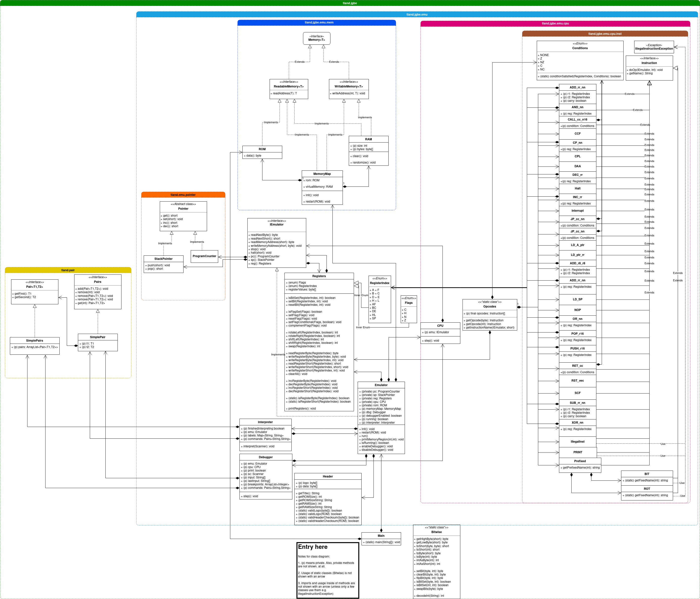

# JGBE

JGBE is a SM83 CPU emulator/interpreter/virtual machine for assembly programs and scripts (see instruction set / assembly language section below.)

[Video Demonstration](demonstration.mp4)

## Running JGBE

To run JGBE:

- Clone/download this repository: `git clone https://github.com/iskake/jgbe`
- To run in an IDE:
    - Open your favorite IDE and click/press the run button, type the keyboard shortcut, etc.
- Or as a jar: 
    - Package as a jar (your IDE can probably do this)
    - Run the jar. For example, in linux: `java -jar jgbe.jar`

## Running programs in JGBE

Running programs can be done in two different ways:

- Running an interactive shell (or, 'CLI interpreter')
- Running a binary file (.zb filename extension) by:
    - Passing the path of the file as a parameter when starting the program (for example when running as a jar (in linux): `java -jar jgbe.jar path/to/file.zb`)
    - Binary files can also be ran using the interactive shell, by typing `open path/to/file.zb`

## Example usage

'Hello world' in JGBE assembly

```
>>> prt "Hello, world!"
>>> run
Hello world!
```

A loop printing numbers 0 - 9

```
>>> ld a, 0
>>> start_loop:
>>>     prt "%d", a
>>>     inc a
>>>     cp 10
>>>     jp nz, start_loop
>>> run
0
1
2
3
4
5
6
7
8
9
```

## General information

JGBE has 64 KiB of RAM (readable and writable memory) available when using the interactive shell, or 32 KiB of non-writable ROM and 32 KiB of RAM when loading binary files.

When using the interactive shell, the program counter (pc) is set to the memory address hex `$100` (notation wise, JGBE uses a leading `0x` or `$` to refer to hex values, and `0b` or `%` to refer to binary values), and writing instructions into the interactive shell will write the corresponding byte(s) of the opcode to memory at the program counter, for example, writing `ld a, b` will write the byte `$78` to address `$100`. Writing another instruction after this, such as `and $34` will write the bytes `$e6` and `$34` to the memory addresses `$101` and `$102` respectively.

## Instruction set / assembly language

JGBE uses a modified version of the instruction set of the SM83 processor (used in the Game Boy systems, documented [here](https://rgbds.gbdev.io/docs/v0.5.2/gbz80.7)), with the following changes/differences:

- The `ei` and `di` instructions are undefined, and do nothing because there are no interrupts (`ei` = "enable interrupts", `di` = "disable interrupts").
    - As a result of no interrupts, the `reti` instruction also does not 
- The `halt` instruction has been changed to wait for the amount of milliseconds stored in the `hl` register.
- The `stop` instruction has been changed to stop the execution of the program and exit.
- New instruction: `prt`, works as a print statement.
    - Strings use the Java format of `System.out.printf` and `String.format()`
    - Arguments can be any of the registers (8-bit or 16-bit).
    - For example, if the bc register holds a value of `$1234`: `prt "Hello, %x!" bc`, will output: `Hello, 1234!`, and `prt "Value of c: %d" c` will output: `Value of c: 52` (note the conversion from hex to decimal.)

If you are curious about how the assembly is supposed to work, please look through the files in the [`src/test/asm/`](src/test/asm/) folder.

It is recommended to read through each file in alphabetical order (`test_alu.asm` to `test_stop.asm`.)

**Note:** that the syntax used in `.asm` files differs from the syntax used in the interactive shell, because the language used is assembly for the sm83 processor (in the Game Boy) NOT the modified version used in JGBE. This means that new instructions (e.g. the `prt` instruction) are not included, and other differences (such as `include` and `section`, which are both not included in the interactive shell) which are.)

### Assembly help / notes

**Register**: instructions modify values in memory or the CPU registers. Registers can be thought of as "global variables" that can store one byte/short (see below) each depending on the register used.
There are eight 8-bit/byte registers: `a`,`f`,`b`,`c`,`d`,`e`,`h`, and `l`. Each register (other than the `f` register) can be used to store one byte of information. Some special cases of the 8-bit registers:

- The `a` register is the _accumulator_ and is used for 8-bit arithmetic operations. For example, the instruction `xor b` will take the exclusive or of `a` and `b`, and store the result in `a`.
- The `f` register is the _flags register_. This register cannot be accessed normally and only holds 4 bits of information (the lower 4 bits always return 0), each bit corresponding to a specific "flag": 
    - The zero flag (`z`) is set when the result of an arithmetic operation is zero.
    - The carry flag (`c`) is (usually) set when the result of an arithmetic operation is an over/underflow.
    - The subtraction flag (`n`) is set when the last instruction executed was a subtraction instruction.
    - The half-carry flag (`h`) is (usually) set when the result of an arithmetic operation over/underflows bit 3/4.

There are six 16-bit/short registers: `af`,`bc`,`de`,`hl`, `sp`, and `pc`. The first 16-bit registers consist of pairs of 8-bit registers. Each register (again, this varies with the `f` register) can be used to store one short (two bytes) of information. Some special cases of the 16-bit registers:

- Since `af` consists of the `f` register, all restrictions apply here as well
- The `sp` register is the _stack pointer_. The stack pointer is a pointer to the stack.
- The `pc` register is the _program counter_. The program counter is a pointer to the next instruction to be executed.

Note: Though they are called "_CPU registers_" and are physically inside the processor in the real world, JGBE does not actually store the registers _in_ the `CPU` class (because then accessing the registers would be a lot harder.)

This is also the case with the `sp` and `pc` registers. They are not stored in the `Registers` class even though they _technically are_ registers, because they are not used in the same way as the other registers (it is better to think of them as separate.)

**Pointers**: Some instructions includes brackets (`[]`). Any value enclosed in brackets is a pointer, so `[$1234]` means the value at the memory address `$1234`. For example if the a register holds the value `$42`, and the memory address `$1234` holds the value `$99`, the instruction, `ld [$1234], a` will load `$42` into `$1234`, overwriting `$99`.
This also applies to registers, so if the hl register has the value `4321`, `[hl]` would be equivelent to `[$4321]`. 

## Tests

Running assembly tests can be done as so:
- Open JGBE
- Write: `open src/test/asm/bin/<FILENAME>.zb`
- To step over the next instruction: press `n` in the debugger, and check that the result in the corresponding assembly file is correct.

Testing of instructions have to be done manually (see the [`src/test/asm/`](src/test/asm/) directory), otherwise each java test file would have to do something such as:

```java
cpu.step()
assertEquals(/* ... */) // check that the register is set to 0
cpu.step()
assertEquals(/* ... */) // check that the register is increased by 1
/* ... */
cpu.step()
assertEquals(/* ... */) // check something else...
```

instead each instruction is commented in the corresponding assembly file.

## Class diagram

See entry at the bottom (with notes.)



(also available in [.pdf](class_diagram.pdf) and [.drawio](class_diagram.drawio) formats.)


## References

[RGBDS docs](https://rgbds.gbdev.io/docs/v0.5.2/gbz80.7) for instruction reference.

[GBDocs opcode table](https://gbdev.io/gb-opcodes//optables/) for opcode indexes.

---

## Notice

You can probably guess this program was originally supposed to be a Game Boy emulator since it (very specifically) emulates the _Game Boy's CPU_.

However, i unfortunately ran out of time to implement all the features needed (joypad+ppu) for the emulator to function properly. 

If you want to see the unfinished Game Boy emulator version, see the `gameboy_emu` branch.

(Also, [Pandocs](https://gbdev.io/pandocs/) was used as a reference for the Game Boy emulator.)