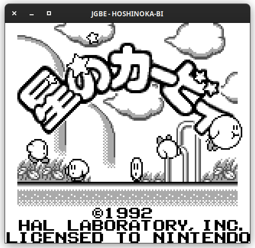

# JGBE

JGBE is a Game Boy (DMG) emulator written in Java.

## Status

Currently, JGBE can run many games well, though certain games do not work as intended.

See the [status](status.md) for more information about the currently implemented features.

## Keybinds

### Controls

| Key         | Input       |
|-------------|-------------|
| X           | A           |
| Z           | B           |
| Enter       | Start       |
| Backspace   | Select      |
| Left arrow  | Left D-pad  |
| Right arrow | Right D-pad |
| Up arrow    | Up D-pad    |
| Down arrow  | Down D-pad  |

### Hotkeys

| Key-combo    | Function          |
|--------------|-------------------|
| Ctrl-R       | Restart           |
| Ctrl-O       | Open new ROM      |
| Ctrl-1,2,3,4 | Resize window     |
| P            | Pause             |
| Left bracket | Frame advance     |
| Space        | Fast forward (4x) |

## Running

Requirements:

- 64bit Linux, macOS, or Windows (currently, only x86 is supported)
- Java 17 (or later)

## Building

Requirements:

- JDK 17 (or later)
- Maven

## References

[Pandocs](https://gbdev.io/pandocs/) for general reference.

[RGBDS docs](https://rgbds.gbdev.io/docs/v0.5.2/gbz80.7) for instruction reference.

[GBDocs opcode table](https://gbdev.io/gb-opcodes//optables/) for opcode indices.